# Arquitetura — IntelliJ Local History Plugin

**Versão documentada:** pós-Fase 3 (branch `main`, 2026-05-24)  
**Stack:** Kotlin 2.1.10 · IntelliJ Platform 2025.2 · Gradle + IntelliJ Platform Gradle Plugin 2.x · JUnit 4

---

## Índice

1. [Visão Geral](#1-visão-geral)
2. [Estrutura de Pacotes](#2-estrutura-de-pacotes)
3. [Registro na Plataforma (plugin.xml)](#3-registro-na-plataforma-pluginxml)
4. [Mecanismos de Captura](#4-mecanismos-de-captura)
5. [Pipeline de Processamento — SnapshotService](#5-pipeline-de-processamento--snapshotservice)
6. [Camada de Storage](#6-camada-de-storage)
7. [Camada de UI](#7-camada-de-ui)
8. [Componentes de Suporte](#8-componentes-de-suporte)
9. [Modelo de Threading](#9-modelo-de-threading)
10. [Fluxo Completo de Dados](#10-fluxo-completo-de-dados)
11. [Formato dos Arquivos em Disco](#11-formato-dos-arquivos-em-disco)

---

## 1. Visão Geral

O plugin captura snapshots automáticos de arquivos-fonte sempre que o usuário edita ou salva, armazenando-os em `.history/` na raiz do projeto no mesmo formato do VS Code Local History (`xyz.local-history`). O caso de uso principal é análise de evolução de código em ambiente acadêmico — os snapshots precisam ser frequentes e fiéis ao estado real do documento em memória, não apenas ao estado salvo em disco.

```
┌─────────────────────────────────────────────────────────────┐
│                        IntelliJ IDEA                        │
│                                                             │
│  ┌──────────────┐    ┌──────────────────────────────────┐  │
│  │   Usuário    │    │           Plugin                  │  │
│  │              │───▶│  DocumentSaveListener             │  │
│  │  digita /    │    │  DocumentChangeListener           │  │
│  │  salva       │    │         │                         │  │
│  └──────────────┘    │         ▼                         │  │
│                      │  SnapshotService (dedup + write)  │  │
│                      │         │                         │  │
│                      │         ▼                         │  │
│                      │  .history/ (flat files)           │  │
│                      │         │                         │  │
│                      │         ▼                         │  │
│                      │  LocalHistoryPanel (Tool Window)  │  │
│                      └──────────────────────────────────┘  │
└─────────────────────────────────────────────────────────────┘
```

**Propriedade central:** o plugin acessa o modelo de documento em memória (`Document`) do IntelliJ diretamente, capturando estados intermediários **independente de saves explícitos**. Isso o diferencia estruturalmente do VS Code Local History, que é cego ao que acontece entre dois `Ctrl+S`.

---

## 2. Estrutura de Pacotes

```
com.github.pablotzeliks.intellijlocalhistory/
│
├── action/
│   └── CompareWithCurrentAction.kt     — diff snapshot vs. estado atual
│
├── listener/
│   ├── DocumentSaveListener.kt         — captura em saves explícitos
│   └── DocumentChangeListener.kt       — captura entre saves (dual debounce)
│
├── model/
│   ├── SnapshotRequest.kt              — DTO de requisição de captura
│   └── SnapshotEntry.kt                — snapshot existente em disco
│
├── service/
│   ├── SnapshotService.kt              — orquestra dedup, debounce e escrita
│   ├── GitignoreService.kt             — garante .history/ no .gitignore
│   ├── LocalHistoryStartupActivity.kt  — inicialização por projeto
│   └── LocalHistoryUiScopeService.kt   — CoroutineScope gerenciado pela plataforma
│
├── storage/
│   ├── SnapshotWriter.kt               — escreve arquivo em .history/
│   └── SnapshotReader.kt               — lista e lê snapshots do disco
│
├── ui/
│   ├── LocalHistoryToolWindowFactory.kt — cria o Tool Window
│   └── LocalHistoryPanel.kt             — JBList de snapshots + toolbar
│
└── util/
    ├── FileFilters.kt                  — decide se arquivo deve ser capturado
    ├── SnapshotGuard.kt                — bloqueia capturas durante restore
    └── DateFormats.kt                  — formatos de timestamp centralizados
```

---

## 3. Registro na Plataforma (plugin.xml)

O `plugin.xml` define o que a IDE instancia e em que escopo:

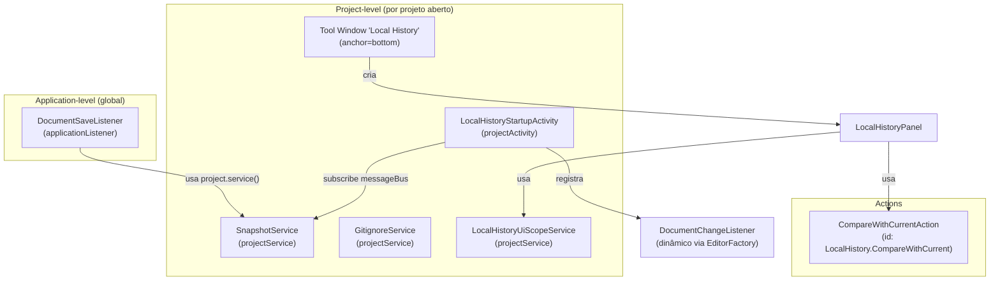

**Observação de escopo:** `DocumentSaveListener` é application-level porque `FileDocumentManagerListener` é um tópico global — não existe versão project-scoped desse evento. Para obter o projeto, usa `ProjectLocator.getInstance().guessProjectForFile(file)` internamente.

---

## 4. Mecanismos de Captura

O plugin tem **dois caminhos independentes** que alimentam o mesmo pipeline de processamento.

### 4.1 DocumentSaveListener — captura em save explícito

Ativado por: `Ctrl+S`, auto-save da IDE (ao trocar aba, ao perder foco), `FileDocumentManager.saveAllDocuments()`.

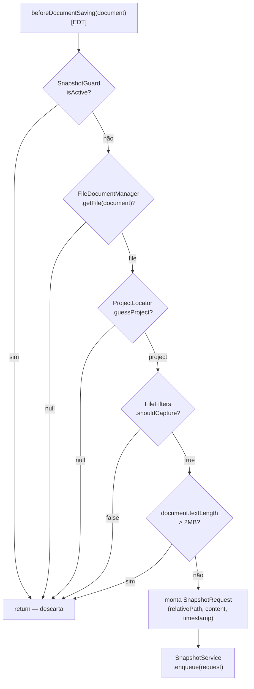

### 4.2 DocumentChangeListener — captura entre saves

Ativado por: qualquer modificação no conteúdo do documento (keystroke, paste, refactor). Registrado via `EditorFactory.eventMulticaster` — cobre todos os documentos do projeto sem duplicação.

Implementa `BulkAwareDocumentListener`: suprime eventos individuais durante operações bulk (refactor, paste massivo), entregando um único evento ao final.

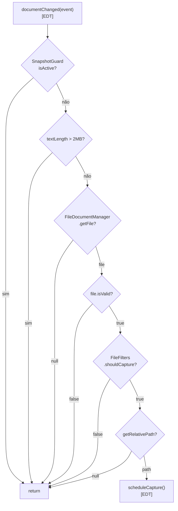

### 4.3 Dual Debounce — estratégia de timers

O problema do debounce simples: um timer de inatividade reseta a cada keystroke, nunca disparando durante digitação contínua longa. A solução usa dois timers independentes por arquivo:

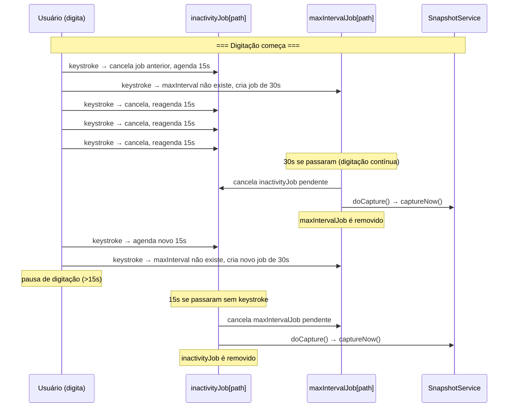

**Constantes atuais** (candidatas a configuráveis na Fase 5):

| Constante | Valor | Comportamento |
|---|---|---|
| `INACTIVITY_TIMEOUT_MS` | 15.000ms | snapshot 15s após última tecla |
| `MAX_INTERVAL_MS` | 30.000ms | snapshot garantido a cada 30s durante typing contínuo |

### 4.4 Coexistência dos dois listeners

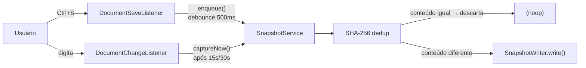

Sobreposições entre os dois caminhos são eliminadas pelo dedup SHA-256. Se o `DocumentChangeListener` capturou um estado e o `DocumentSaveListener` chega logo depois com o mesmo conteúdo, o hash é igual e nenhum arquivo duplicado é criado.

---

## 5. Pipeline de Processamento — SnapshotService

`SnapshotService` é um `@Service(Level.PROJECT)` — uma instância por projeto aberto. Recebe o `CoroutineScope` injetado automaticamente pela plataforma.

### 5.1 Estrutura interna

```
SnapshotService
├── debounceJobs: ConcurrentHashMap<String, Job>    — Job de debounce por relativePath
├── lastHashByPath: ConcurrentHashMap<String, String> — último hash SHA-256 por relativePath
│
├── enqueue(request)
│   ├── cancela debounceJobs[path] anterior
│   └── lança Job em Dispatchers.IO:
│       ├── delay(500ms)
│       └── processSnapshot(request)
│
├── captureNow(request)
│   └── lança Job em Dispatchers.IO:
│       └── processSnapshot(request)
│
└── processSnapshot(request)   ← ponto central, não-atômico (ver seção 12)
    ├── sha256(content)
    ├── check lastHashByPath[path] == newHash → return (dedup in-memory)
    ├── if !lastHashByPath.containsKey(path):
    │   ├── SnapshotReader.listSnapshots()
    │   ├── SnapshotReader.readContent(snapshots.first())
    │   └── sha256(diskContent) == newHash → return (dedup cross-session)
    ├── SnapshotWriter.write(request)
    ├── lastHashByPath[path] = newHash
    ├── GitignoreService.ensureHistoryIgnored()
    └── messageBus.syncPublisher(TOPIC).onSnapshotAdded(path)
```

### 5.2 Lógica de deduplicação

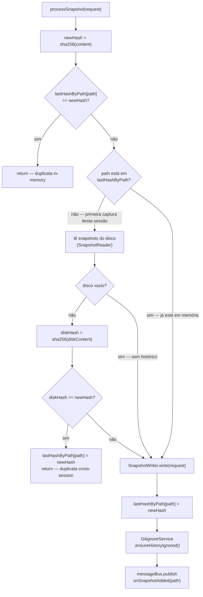

---

## 6. Camada de Storage

### 6.1 SnapshotWriter

Responsável exclusivamente por **escrever** um snapshot. Usa `java.nio.file` diretamente (não VFS) para evitar re-indexação pelo IntelliJ (ver decisão D-003).

```
write(request):
  timestamp = request.timestamp.format("yyyyMMddHHmmss")
  fileName  = "${request.fileName}_${timestamp}${request.fileExtension}"
  dir       = Path(projectBasePath, ".history", *relativeDir.split('/'))
  Files.createDirectories(dir)
  Files.writeString(dir/fileName, request.content, UTF_8)
```

### 6.2 SnapshotReader

Responsável por **listar** e **ler** snapshots. Nunca escreve.

```
listSnapshots(relativePath, projectBasePath):
  historyDir = Path(projectBasePath, ".history", relativeDir)
  Files.list(historyDir)
    .filter { matchesSnapshot(name, baseName, ext) }   — exige {baseName}_{14 dígitos}{ext}
    .mapNotNull { parseEntry(file, relativePath) }      — parseia timestamp, ignora inválidos
    .sortedByDescending { timestamp }                   — mais recente primeiro

readContent(entry):
  entry.file.readText(UTF_8)
```

**Proteção contra prefixos similares:** `matchesSnapshot` exige que o nome comece exatamente com `{baseName}_` seguido de 14 dígitos. `MainExtra_*.kt` não faz match para uma query de `Main.kt`.

### 6.3 Estrutura de diretórios em disco

```
{projectRoot}/
└── .history/
    ├── src/
    │   ├── main/
    │   │   └── kotlin/
    │   │       └── com/example/
    │   │           ├── Main_20260524103015.kt
    │   │           ├── Main_20260524103045.kt
    │   │           └── Main_20260524103120.kt
    │   └── model/
    │       ├── User_20260524091200.kt
    │       └── User_20260524093015.kt
    └── README_20260524080000.md
```

A estrutura espelha exatamente o projeto fonte — `relativePath` do arquivo determina o subdiretório dentro de `.history/`.

---

## 7. Camada de UI

### 7.1 Inicialização do Tool Window

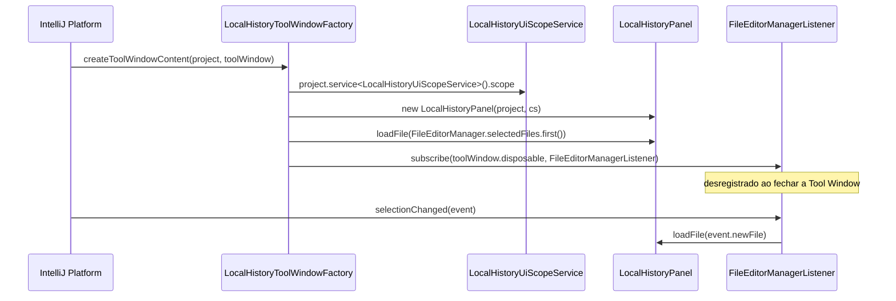

### 7.2 Carregamento da lista de snapshots

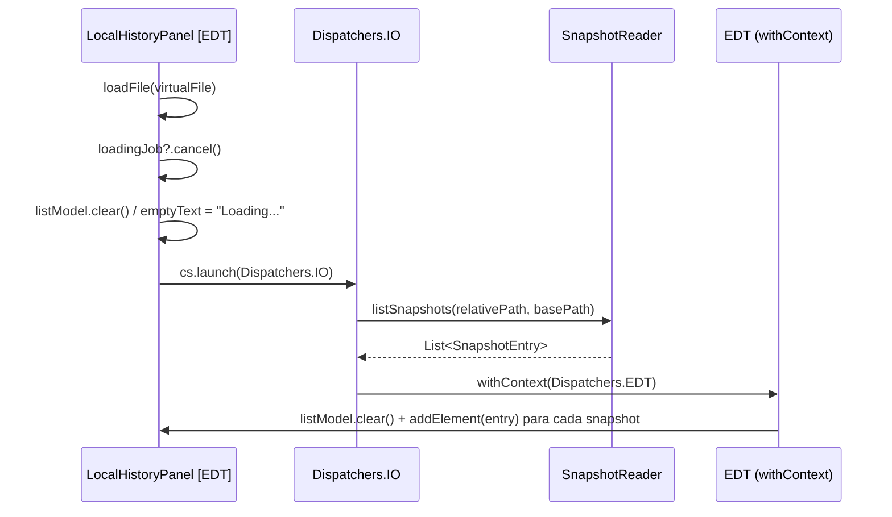

### 7.3 Atualização automática ao capturar snapshot

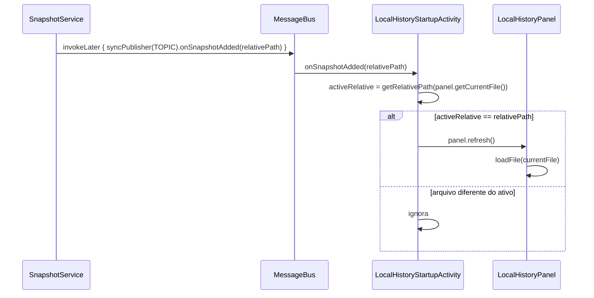

### 7.4 Abertura do diff (CompareWithCurrentAction)

Acionado por: double-click na lista ou botão na toolbar do Tool Window.

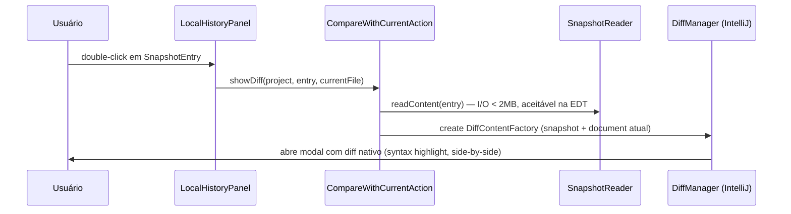

---

## 8. Componentes de Suporte

### 8.1 FileFilters

Porteiro único que decide se um arquivo deve ser capturado. Chamado nos dois listeners antes de qualquer processamento.

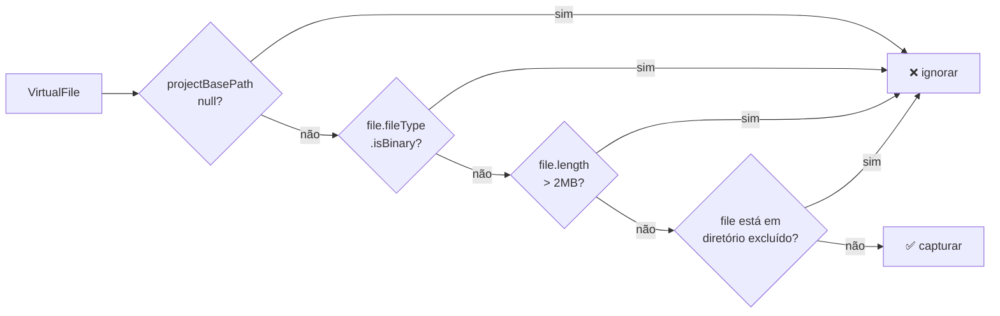

**Diretórios excluídos (hardcoded, Fase 5 tornará configurável):**
`.history` · `.git` · `.idea` · `.gradle` · `node_modules` · `build` · `target` · `out` · `dist`

**Ausência conhecida:** arquivos de 0 bytes passam por todos os filtros (ver seção 12 — F-004).

### 8.2 SnapshotGuard

Previne que um restore acione um novo snapshot do arquivo restaurado (loop).

```
SnapshotGuard (object — singleton de aplicação)
├── restoringCount: AtomicInteger
├── isActive(): Boolean    → restoringCount.get() > 0
└── withGuard(block):
    ├── restoringCount.incrementAndGet()
    ├── block()
    └── restoringCount.decrementAndGet()    [finally]
```

Ambos os listeners verificam `SnapshotGuard.isActive()` como primeiro passo, descartando a captura enquanto um restore estiver em andamento.

**Limitação:** `SnapshotGuard` é um `object` Kotlin — singleton de nível de aplicação. Se dois projetos estiverem abertos simultaneamente, um restore em um projeto bloqueia capturas no outro. Para o caso de uso atual (análise de prova = 1 projeto), não é um problema prático.

### 8.3 GitignoreService

Garante que `.history/` esteja no `.gitignore` raiz do projeto. Executado uma única vez por sessão por projeto.

```
GitignoreService (PROJECT service)
├── gitignoreEnsured: AtomicBoolean = false
└── ensureHistoryIgnored():
    ├── compareAndSet(false, true) → se false, já executado, retorna
    ├── WriteAction.runAndWait { ... }   — DEVE rodar em Dispatchers.IO (não EDT)
    │   ├── se .gitignore não existe → cria com ".history/"
    │   └── se existe e não contém ".history/" → appenda
    └── em caso de exceção → reseta AtomicBoolean para false (retry na próxima captura)
```

Usa VFS (`VfsUtil.saveText`) neste caso específico pois o `.gitignore` precisa ser rastreado pela IDE.

### 8.4 LocalHistoryUiScopeService

```kotlin
@Service(Service.Level.PROJECT)
class LocalHistoryUiScopeService(val scope: CoroutineScope)
```

Wrapper que expõe o `CoroutineScope` gerenciado pelo ciclo de vida do projeto para componentes que não recebem scope via injeção automática (como `LocalHistoryPanel`, instanciado manualmente pelo `ToolWindowFactory`). O IntelliJ Platform cancela automaticamente o scope ao fechar o projeto.

---

## 9. Modelo de Threading

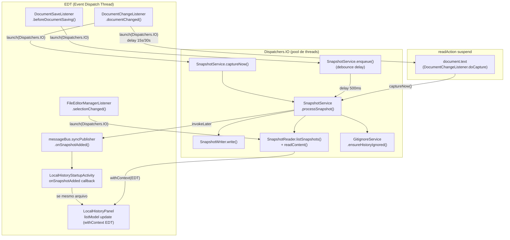

**Regras de threading respeitadas:**

| Operação | Thread | Justificativa |
|---|---|---|
| Leitura de `VirtualFile` (path, length) | EDT | Safe em 2025.2+ conforme documentação JetBrains |
| Leitura de `document.text` | `readAction {}` | Necessita read lock da plataforma |
| Escrita em `.history/` via `java.nio.file` | `Dispatchers.IO` | I/O blocking — nunca na EDT |
| `SnapshotReader.listSnapshots()` | `Dispatchers.IO` | I/O blocking |
| `GitignoreService.ensureHistoryIgnored()` | `Dispatchers.IO` | `WriteAction.runAndWait` bloqueia até EDT estar livre — deadlock se chamado da EDT |
| Atualização do `JBList` (listModel) | EDT via `withContext(Dispatchers.EDT)` | Swing não é thread-safe |
| Publicação no `messageBus` | EDT via `invokeLater` | Subscribers de UI esperam EDT |

---

## 10. Fluxo Completo de Dados

### Caminho 1 — Save explícito (Ctrl+S)

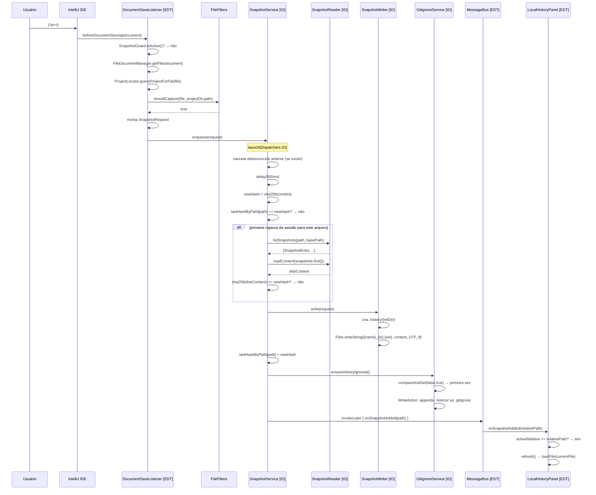

### Caminho 2 — Mudança de documento (entre saves)

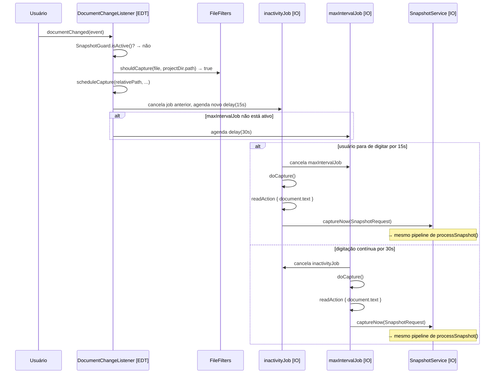

---

## 11. Formato dos Arquivos em Disco

### Naming convention

```
{nomeDoArquivoSemExtensão}_{yyyyMMddHHmmss}{.extensão}

Exemplos:
  CategoriaService_20260522183538.java
  Main_20260524103015.kt
  README_20260524080000.md
  Makefile_20260524120000          ← sem extensão
```

Compatível com o VS Code Local History (`xyz.local-history`) — snapshots gerados por um editor aparecem no outro.

### Parsing do timestamp (SnapshotReader)

```
"CategoriaService_20260522183538.java"
         └── nameWithoutExtension = "CategoriaService_20260522183538"
                    └── takeLast(14) = "20260522183538"
                              └── LocalDateTime.parse("yyyyMMddHHmmss")
```

Arquivos com timestamp inválido (ex: mês 13) são silenciosamente ignorados — `parseEntry` retorna `null`, `mapNotNull` os descarta.

### Estrutura de um SnapshotRequest (DTO de entrada)

```
SnapshotRequest(
  relativePath    = "src/service/CategoriaService.java"   — caminho relativo ao projeto
  fileName        = "CategoriaService"                    — sem extensão
  fileExtension   = ".java"                               — com ponto, ou "" se sem extensão
  content         = "public class ..."                    — texto completo do Document
  timestamp       = LocalDateTime.now()                   — capturado no momento do evento
  projectBasePath = "/Users/pablo/projeto"                — raiz absoluta do projeto
)
```

### Estrutura de um SnapshotEntry (DTO de saída)

```
SnapshotEntry(
  file                = File("/.../.history/src/service/CategoriaService_20260522183538.java")
  timestamp           = LocalDateTime(2026, 5, 22, 18, 35, 38)
  originalRelativePath = "src/service/CategoriaService.java"
  lengthBytes         = 2048L                             — file.length(), para exibição na UI
)
```

